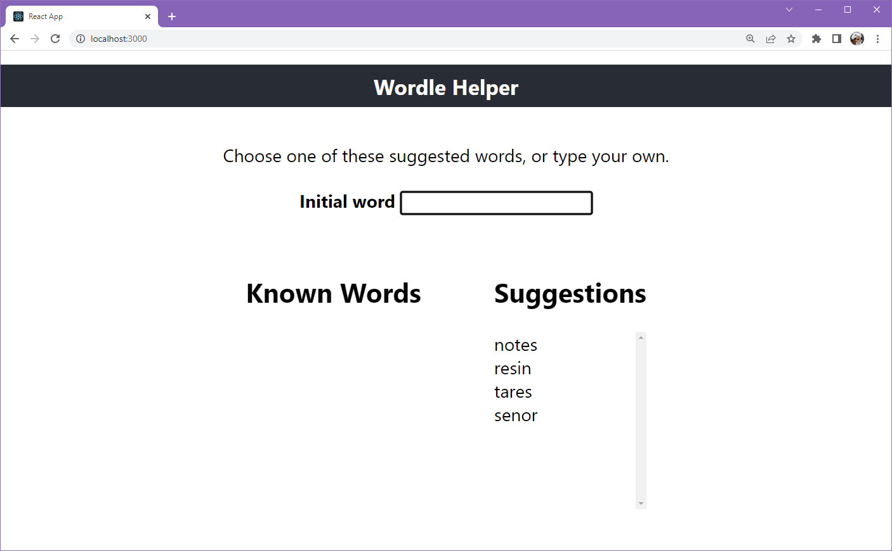

# Combined NodeJS backend and React front-end

## Overview

This is a full-stack React app that will help user solve [Wordle](https://www.nytimes.com/games/wordle/index.html). To use it, you can use a version of this app that is deployed in Heroku or you can clone this repo, then launch the backend and front-end part of the application. 

## How to Use the Wordle Helper

This app is intended to be used as you play Wordle. Either type the words that you have entered in Wordle or choose the word from the list on the right. After you chose the word, click on the letter to change it from grey (incorrect letter) to yellow (letter is used in the word but in the wrong location) or green (letter is in the correct location). 



## How to Run the Application Locally

To run this application locally, you will need to have a reasonably recent NodeJS installed. Clone this repo, then follow the steps to launch the front-end and back-end services. 

### Launching the Backend Service

To start the backend:
```
npm install
npm start
```

To test the backend to get filtered words:

```
curl --header "Content-Type: application/json" --request POST --data '{"exclude": ["l", "a", "t", "e", "r", "u", "n", "d", "c", "h", "p"], "rules": {"s":["!0"],"s":["!4"],"o":["!1"], "o" : ["2"]}}' http://localhost:8081/api/getFilteredWords

curl --header "Content-Type: application/json" --request POST --data '{"exclude": ["r","e","s","i","n","l","o","t","h","g"], "rules": {"a":["!2","1"],"k":["3"],"y":["4"]}}' http://localhost:8081/api/getFilteredWords

curl --header "Content-Type: application/json" --request POST --data '{"exclude": ["n", "t", "e", "s","a", "r", "i", "d","v", "u", "h", "m","f", "c", "k"], "rules": { "o": [ "1" ],"c": [ "!1", "!3", "0" ],"y": [ "4", "4" ]}}' http://localhost:8081/api/getFilteredWords
```

To test the backend to get expanded words:

```
curl --header "Content-Type: application/json" --request POST --data '{"exclude": ["r","e","s","i","n"], "rules": {"a":["!2","1"],"k":["3"],"y":["4"]}}' http://localhost:8081/api/getExpandedWords

curl --header "Content-Type: application/json" --request POST --data '{"exclude": ["s","i","n", "l", "a", "t", "h"], "rules": { "r": [ "!0" ], "e": [ "!1" ], "o": [ "1" ] }}' http://localhost:8081/api/getExpandedWords

```

## Launching the React Frontend

To build the front-end:
```
cd client
npm install
npm start
```

To create an optimized production build:
```
cd client
npm build
```

To serve the React front-end from node, enable the static web pages from the server/index.js.

